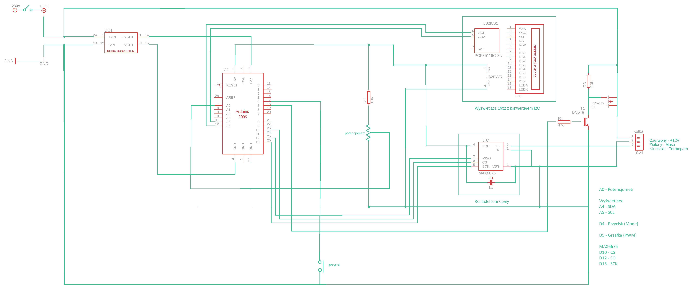
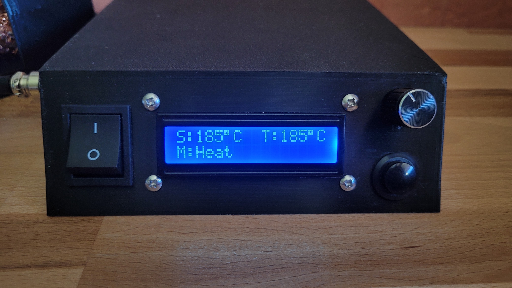
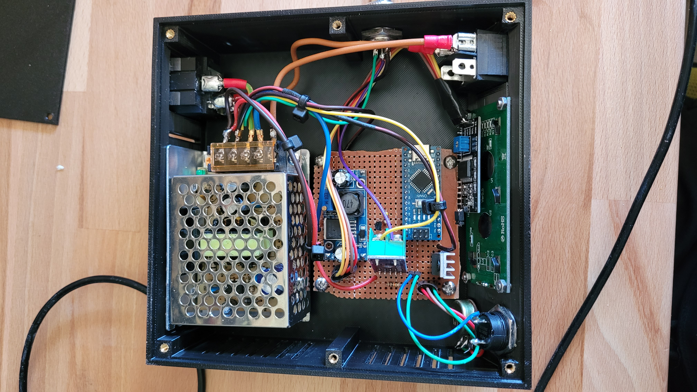
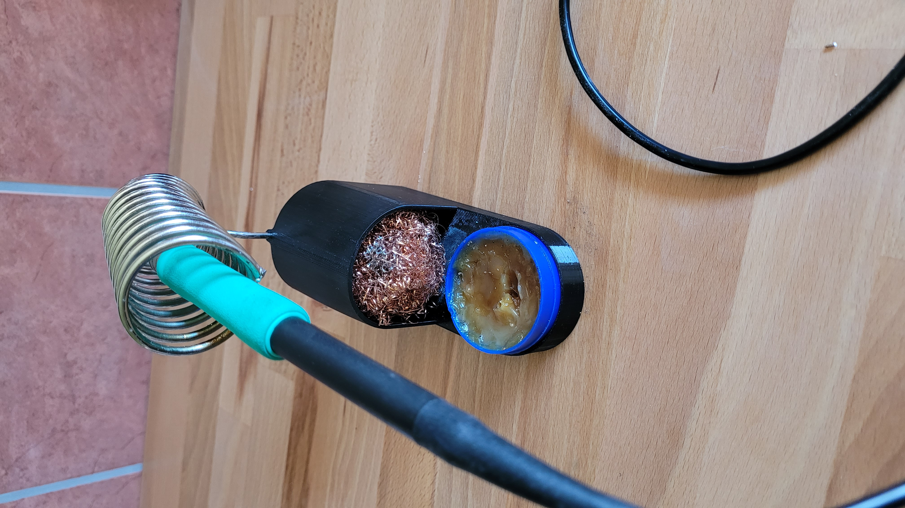

# Arduino MAX6675 Soldering Station

[English version below](#english-version) | [Przejdź do wersji polskiej](#polska-wersja)

---

## Polska Wersja

### O Projekcie
Zaawansowana stacja lutownicza DIY oparta na mikrokontrolerze Arduino Nano. Projekt łączy precyzyjne sterowanie cyfrowe z ergonomiczną obudową 3D. System wykorzystuje termoparę typu K (MAX6675) oraz tranzystor MOSFET do sterowania grzałką 12V.

### Główne Funkcjonalności
* **Sterowanie PID:** Autorski algorytm zapewniający stabilną temperaturę bez przeregulowań (overshoot).
* **Filtracja EMA (Exponential Moving Average):** Wykładnicze wygładzanie sygnału z potencjometru - eliminuje "skakanie" nastawy spowodowane szumami zasilacza.
* **Tryb Sleep:** Funkcja szybkiego schłodzenia grotu do 100°C po naciśnięciu przycisku Mode.
* **Synchronizacja Pomiaru:** Czasowe wyłączanie grzałki (PWM=0) podczas odczytu temperatury, co eliminuje błędy pomiarowe wywołane zakłóceniami EM.

### Schemat
Pełny schemat połączeń znajduje się w pliku `Hardware/diagram.png`.

### Struktura Repozytorium
* `/Firmware/` - Kod źródłowy Arduino (PID & Logic).
* `/Hardware/` - Schemat ideowy (`diagram.png`) wraz z rozpiską pinów.
* `/3D Models/` - Kompletny projekt obudowy w formacie `.3mf`.
* `/Media/` - Dokumentacja fotograficzna gotowego urządzenia.

### Inspiracje
Projekt powstał inspirując się projektem z kanału **[Zrobisz to SAM](https://www.youtube.com/@zrobisz_to_sam_)**. 
W mojej wersji wprowadziłem następujące zmiany i usprawnienia:
1. Pełna implementacja algorytmu PID dla lepszej stabilności cieplnej.
2. Dodanie filtracji cyfrowej (EMA) dla sygnału z potencjometru.
3. Projektowanie od podstaw obudowy 3D razem z ergonomiczną podpórką.
4. Usunięcie zbędnych linijek kodu.

---

## English Version

### About The Project
An advanced DIY soldering station powered by an Arduino Nano microcontroller. This project combines precise digital control with an ergonomic 3D-printed enclosure. The system utilizes a K-type thermocouple (MAX6675) and a MOSFET transistor to drive a 12V heating element.

### Key Features
* **PID Control:** Custom-tuned algorithm ensuring stable temperature without overshooting.
* **EMA Filtering (Exponential Moving Average):** Software-based smoothing of the potentiometer signal - eliminates setpoint "jitter" caused by power supply noise.
* **Sleep Mode:** Rapid tip cooldown to 100°C at the press of the Mode button.
* **Measurement Synchronization:** Momentary heater deactivation (PWM=0) during temperature readouts to eliminate measurement errors caused by electromagnetic interference (EMI).

### Diagram
The full wiring diagram is available in the `Hardware/diagram.png` file.

### Repository Structure
* `/Firmware/` - Arduino source code (PID & Logic).
* `/Hardware/` - Circuit diagram (`diagram.png`) with pinout configuration.
* `/3D Models/` - Complete 3D enclosure project in `.3mf` format.
* `/Media/` - Photographic documentation of the finished device.

### Inspirations
This project was inspired by the project from the **[Zrobisz to SAM](https://www.youtube.com/@zrobisz_to_sam_)** YouTube channel.
In my version, I have introduced the following improvements:
1. Full PID algorithm implementation for superior thermal stability.
2. Added digital filtering (EMA) for the potentiometer input signal.
3. From-scratch 3D design of the enclosure, including an ergonomic iron stand.
4. Removed unnecessary lines of code for better optimization.

---

## Galeria / Gallery
| Tryb Pracy / Heat Mode | Wnętrze / Inside | Podpórka / Stand |
|---|---|---|
|  |  |  |

---
*Created by Wojciech Z | MIT License | 2026*
